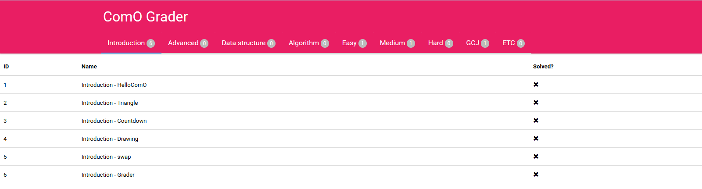
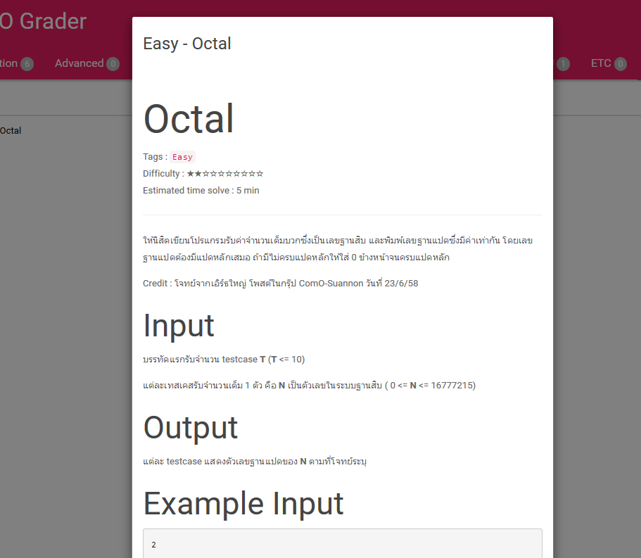
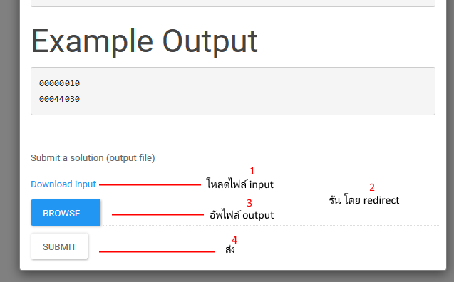
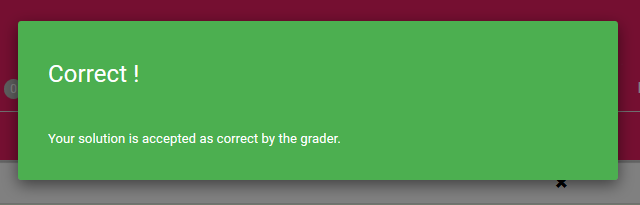
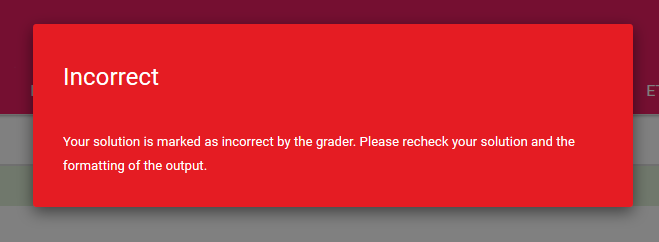

How to use grader ?
====================
ปีนี้เป็นปีแรกที่ชุมนุมจะมี grader online ใช้ ซึ่งยังคงอยู่ในช่วงทดสอบ ดังนั้นอาจมีปัญหาและอื่นๆขึ้นได้ แต่อย่างไรก็ตามเชื่อว่าน่าจะพอใช้ได้ และจะช่วยในการเรียนการสอนของชุมนุมให้ดีขึ้น

[http://monopoly.comlu.com/ComO/newhome.html](http://monopoly.comlu.com/ComO/newhome.html) เนื่องจากใช้โฮสต์ฟรี จึงอาจมีการล่มเกิดขึ้นบ้าง

Interface
--------

โจทย์จะแบ่งเป็นหมวดๆตามเนื้อหาและความยากง่าย คือ
- Introduction หมวดเขียนโปรแกรมพื้นฐาน
- Advanced หมวดเขียนโปรแกรมแบบขั้นสูง
- Algorithm หมวด algorithm แนวคิดต่างๆ
- Data structure หมวดเกี่ยวกับการเก็บข้อมูล
- Easy โจทย์ระดับง่าย สำหรับคนพึ่งฝึกเขียนโปรแกรมใหม่ๆ ถึง สอวน. ค่าย 1
- Medium โจทย์ระดับปานกลาง ประมาณ สอวน. ค่าย 2
- Hard โจทย์ระดับยาก ส่วนใหญ่เป็นการแข่งระดับประเทศ
- GCJ โจทย์ที่มี subtask ย่อยๆ เพราะการแข่งหลายรายการจะใช้ระบบ subtask
- ETC โจทย์อื่นๆ

สำหรับหน้าตา grader ก็จะเป็นหมวดหมู่โจทย์อยู่ และจะมีรายการโจทย์ต่างๆในหมวดนั้น เมื่อกดเข้าไปก็จะเป็นหน้าโจทย์ และรวมถึงปุ่มให้ส่งคำตอบ

Submit answer
-------

สำหรับคำตอบนั้น เป็น output ของโปรแกรม จาก input ที่ให้ เช่น โปรแกรมบวกเลข ใส่ 5 3 เข้าไป คำตอบที่จะส่งคือ 8 โดย input จะเป็นไฟล์ให้ดาวน์โหลด และให้เราอัพโหลด output จากโปรแกรมเราขึ้นไป

สำหรับการอ่าน input / output นั้น แนะนำให้ใช้ file redirection คือเขียนโปรแกรมใช้ scanf ตามปกติ และสั่งผ่าน cmd ให้ redirect เอา เช่น โปรแกรมชื่อ `prog.exe` , ไฟล์ input ชื่อ `input.in` ต้องการให้ออกมาเป็น `output.out` ก็ใช้ `prog.exe < input.in > output.out` และเวลาส่งก็ส่ง `output.out` ขึ้นไป

Verdict
------

ผลการตรวจจะมี 2 อย่างคือ ถูก (Correct) และ ผิด (Incorrect) ซึ่งการผิดนั้นจะไม่บอกสาเหตุ เราต้องหาเองว่าเราเขียนผิดตรงไหนหรือเปล่า โปรแกรมติดบัคมั้ย โดนเคสดัก หรืออาจจะเรียง output ไม่ดี